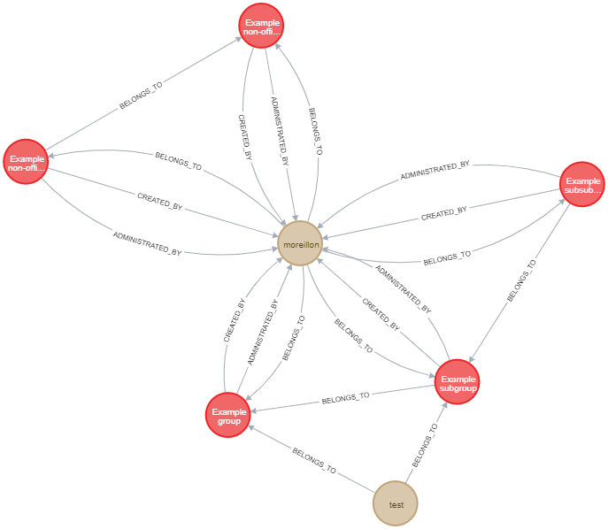

# Group manager

As a graph database Neo4J is a great choice to manage highly relational data. On the other side, a great number of applications feature at least some form of user management system. With Neo4J, those users can be store as nodes and connected to other items via relationships. A typical example would be a blog, where both articles and users are individual nodes while authorships are represented by a relationship.

When dealing with a large number of users, it can become convenient to arrange those in groups. Here, groups too can be represented as nodes and the membership of a user by a relationship. However, building group management logic from scratch for every application would be tedious.

This microservice, named Group manager, proposes a solution to this problem by offering just the generic logic to handle groups and their relationships, making it easy to integrate in a microservice architecture, alongside other services managing Neo4J records.

The application is built using Node.js and the Express framework.

An example of application relying on Group manager is [申請マネージャ](https://github.com/jtekt/web-based-approval-system), A web based approval system for application forms and other documents

For more information, please visit the project page [here](https://articles.maximemoreillon.com/articles/398)

## API
### Groups
| Endpoint | Method | query/body | Description |
| --- | --- | --- | --- |
| /v3/groups/ | GET | tbd | Returns list of groups |
| /v3/groups/ | GET | tbd | Returns list of groups |
| /v3/groups/{group_id} | GET | - | Returns information about the group corresponding to the provided ID |
| /v3/groups/{group_id} | PATCH | properties | Updates properties of a group |
| /v3/groups/{group_id} | DELETE | - | Deletes a group |
| /v3/groups/{group_id}/join | POST | - | Join a group |
| /v3/groups/{group_id}/leave | POST | - | leave a group |

### Subgroups
| Endpoint | Method | query/body | Description |
| --- | --- | --- | --- |
| /v3/groups/{group_id}/groups | GET | - | Returns the groups belonging to the group with the given ID |
| /v3/groups/{group_id}/groups/direct | GET | - | Returns the groups directly belonging to the group with the given ID |
| /v3/groups/{group_id}/parent_groups | GET | - | Returns the groups to which the group with the given ID belongs |
| /v3/groups/{group_id}/groups/{subgroup_id} | POST | - | Puts a group into another |
| /v3/groups/{group_id}/groups/{subgroup_id} | DELETE | - | Removes a subgroup from a group |

### Members
| Endpoint | Method | query/body | Description |
| --- | --- | --- | --- |
| /v3/groups/none/members | GET | - | Returns users without a group |
| /v3/groups/{group_id}/members | GET | - | Returns the users belonging to the group with the given ID |
| /v3/groups/{group_id}/members/{user_id} | POST | - | Adds a user to the group |
| /v3/groups/{group_id}/members/{user_id} | DELETE | - | Removes a user from the group |
| /v3/members/{member_id}/groups | GET | - | Gets the groups of a member, here, use 'self' as member_id of one's own groups |

### Administrators
| Endpoint | Method | query/body | Description |
| --- | --- | --- | --- |
| /v3/groups/{group_id}/administrators | GET | - | Returns the administrators of the group with the given ID |
| /v3/groups/{group_id}/administrators/{administrator_id} | POST | - | Adds an administrator to the group |
| /v3/groups/{group_id}/administrators/{administrator_id} | DELETE | - | Removes an administrator from the group |
| /v3/administrators/{administrators_id}/groups | GET | - | Gets the groups administrated by a user, here, use 'self' as member_id of one's own groups |

## Pagination

To limit the size of responses, groups, members and administrators are provided in a paginated manner. The page size and index of the first item on the page can be defined using the query parameters 'batch_size' and 'start_index' respectively.
